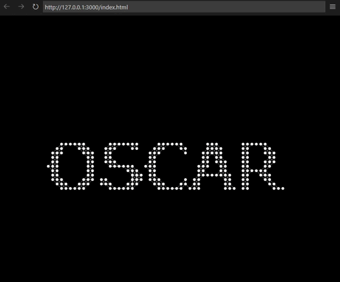

# Projeto da mentoria 3ª Semana (Animação com Mouse)

 Projeto destinado a criação de animação em site com interação com mouse do usuário. Atividade de Mentoria.

 
 
 :fire: Proposta do projeto :nerd_face:

 <h1 align="center"> 
  
</h1>

O que acha de acessar o projeto? 
 <a href="https://oscarlojr.github.io/interacao_mouse/" target="_blank">Tela Inicial</a>